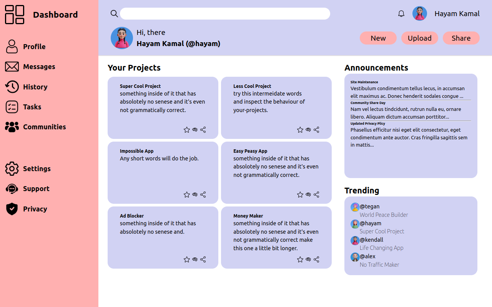

# Admin Dashboard

 

## Description
An Admin Dashboard web page.

The project is the capstone of the Intermediate HTML and CSS course of the Odin Project.

The aim of the exercise is to practice CSS grid and combine this layout with the flexbox layout, to make a beautiful website

## Time Spent 🕓

I spent a total of **12 hours and 45 minutes** working on this project, distributed over **4 days ☺️**.

| Day | Time Spent |
| --- | :---: |
| 1 | 1 hours and 4 minutes  |
| 2 | 2 hours and 50 minutes |
| 3 | 5 hours and 14 minutes |
| 4 | 3 hours and 19 minutes |

## Technologies Used

- HTML
- CSS (Flexbox, Grid).

## Demo

You can view a live demo of the sign-up-Form [here](https://hayam999.github.io/Admin-Dashboard). 

**Note: the project isn't responsive. so there well be some changes in your screen than in the picture above"**

## Credits:
<a href="https://www.flaticon.com/free-icons/user" title="user icons">User icons created by Freepik - Flaticon</a>

